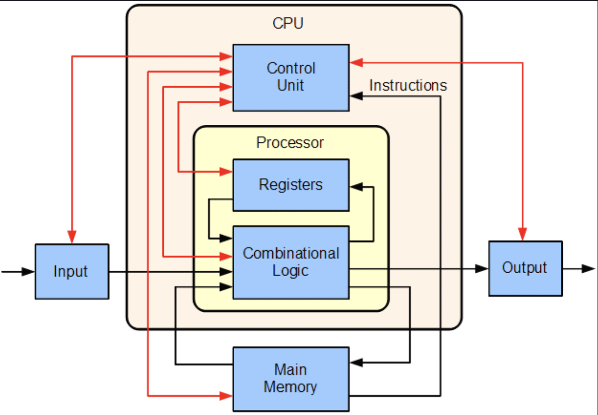

# CPU — Central Processing Unit

The CPU (Central Processing Unit) is the general-purpose processor of a computer.

As an ML Engineer, you don't need to understand CPU design at the transistor level. The important thing is to understand **what the CPU is doing in an ML system, how it executes work, and which hardware resources affect performance**.



---

## What does a CPU actually do?

When we run a program, the CPU executes machine instructions.

A simplified flow is:

```text
Program
   ↓
Compiler / Interpreter
   ↓
Machine Instructions
   ↓
CPU
   ↓
Execution
   ↓
Result
```

For example:

```python
x = a + b
```

Eventually, this becomes lower-level instructions that the CPU can execute.

The CPU repeatedly performs operations such as:

```text
Fetch instruction
      ↓
Decode instruction
      ↓
Execute instruction
      ↓
Store result
```

This happens extremely quickly, billions of times per second on modern CPUs.

---

## CPU Architecture — High Level

A simplified CPU can be viewed as:

```text
                    CPU
                     │
        ┌────────────┼────────────┐
        │            │            │
      Core 0       Core 1       Core 2 ...
        │            │
   ┌────┴────┐  ┌────┴────┐
   │         │  │         │
Registers  Cache Registers Cache
   │
Execution Units
   │
   ├── ALU
   ├── Vector / SIMD units
   └── Other execution units
```

Modern CPUs are much more complicated than this, but this model is enough to understand most ML workloads.

---

## Important CPU Components

The main concepts we will cover are:

### 1. Cores

A CPU core is an independent processing unit capable of executing instructions.

More cores allow more independent work to be processed in parallel, provided the software can make use of them.

[Learn about CPU cores →](parts/cores-and-threads.md)

---

### 2. Threads

Threads represent independent sequences of work.

Modern CPUs can support multiple hardware threads per physical core using technologies such as SMT (Simultaneous Multithreading).

[Learn about cores and threads →](parts/cores-and-threads.md)

---

### 3. Instruction Execution

The CPU doesn't directly execute Python, JavaScript, or other high-level source code.

Eventually, software is converted into machine instructions that the CPU understands.

[Learn how CPU instructions are executed →](parts/instruction-execution.md)

---

### 4. Cache and Memory

CPUs use several levels of cache to keep frequently accessed data close to the execution units.

A simplified hierarchy is:

```text
Registers
    ↓
L1 Cache
    ↓
L2 Cache
    ↓
L3 Cache
    ↓
RAM
    ↓
Storage
```

Moving data from a nearby cache is generally much faster than fetching it from system RAM.

[Learn about cache and memory →](parts/cache-and-memory.md)

---

### 5. CPU Performance

CPU performance isn't determined by clock speed alone.

Important factors include:

```text
Core count
Clock speed
IPC
Cache
Memory bandwidth
Instruction set
SIMD / vector processing
Architecture
```

[Learn about CPU performance →](parts/cpu-performance.md)

---

# CPU in an ML System

The CPU is still heavily involved even when model inference runs on a GPU.

For example:

```text
                    CPU
                     │
          Load / preprocess data
                     │
                     ↓
                   RAM
                     │
                  PCIe
                     │
                     ↓
                   GPU
                     │
              Model inference
                     │
                     ↓
                   GPU
                     │
                  PCIe
                     │
                     ↓
                   CPU
                     │
            Post-processing
                     │
                     ↓
                 Response
```

The GPU may perform the main neural-network computation, but the CPU can still handle:

* Data loading
* Image/video decoding
* Preprocessing
* Tokenization
* Application logic
* Post-processing
* Networking
* API serving
* CPU-GPU coordination

This means a powerful GPU does not automatically make the entire ML system fast.

---

# CPU vs GPU

A simple way to think about the difference:

| CPU                                             | GPU                                      |
| ----------------------------------------------- | ---------------------------------------- |
| General-purpose processor                       | Massively parallel processor             |
| Smaller number of powerful cores                | Large number of parallel execution units |
| Excellent at sequential and branching workloads | Excellent at large parallel workloads    |
| Runs the operating system and applications      | Primarily used as an accelerator         |
| Good for orchestration and preprocessing        | Excellent for neural-network computation |

The goal is not to decide that one is "faster".

The goal is to understand **which workload belongs on which processor**.

---

# Why CPU Knowledge Matters for ML Engineers

Consider an inference pipeline:

```text
Input
  ↓
Read file
  ↓
Decode
  ↓
Preprocess
  ↓
GPU inference
  ↓
Postprocess
  ↓
Response
```

If GPU inference takes only 30 ms but CPU preprocessing takes 50 ms, optimizing the GPU alone will not solve the overall latency problem.

Understanding the CPU helps identify these bottlenecks.

---

# What We Will Learn

```text
CPU
│
├── Cores & Threads
├── Instruction Execution
├── Cache & Memory
├── CPU Performance
└── CPU ↔ GPU Communication
```

The goal is practical:

> Understand enough CPU architecture to identify bottlenecks, choose appropriate hardware, optimize ML workloads, and make better infrastructure decisions.

---

## Next

Start with:

**[Cores and Threads →](parts/cores-and-threads.md)**
