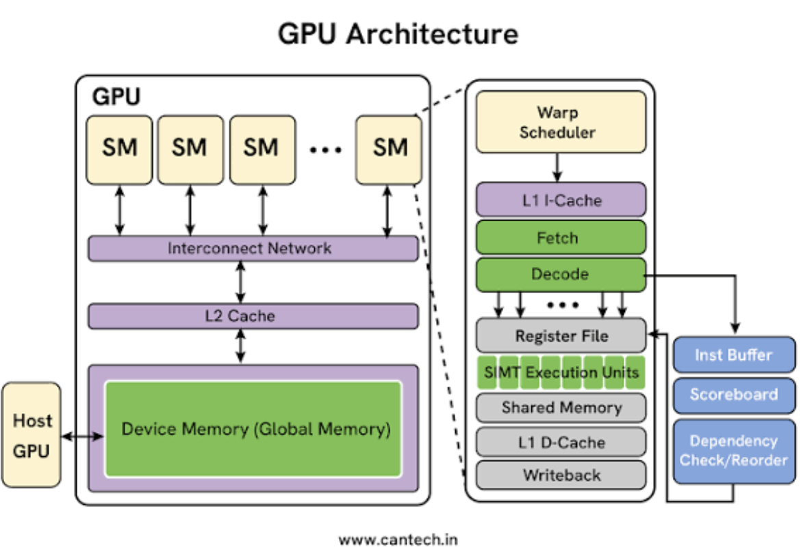

# GPU — Graphics Processing Unit

The GPU (Graphics Processing Unit) is a processor designed to perform a large number of operations in parallel.

Although GPUs were originally designed for graphics, they are now one of the most important pieces of hardware for Machine Learning because neural networks perform huge numbers of parallel mathematical operations.



---

## What does a GPU actually do?

A GPU executes many operations simultaneously.

A simplified view is:

```text
ML Model
   ↓
Operations
   ↓
GPU Kernels
   ↓
Thousands of Parallel Threads
   ↓
GPU Execution Units
   ↓
Result
```

For example, a neural network may need to perform a large matrix multiplication.

Instead of processing every calculation one after another, the GPU can divide the work into many smaller operations and execute them in parallel.

---

## GPU Architecture — High Level

A simplified GPU can be viewed as:

```text
                         GPU
                          │
        ┌─────────────────┼─────────────────┐
        │                 │                 │
       SM 0              SM 1              SM 2 ...
        │                 │
   ┌────┴────┐       ┌────┴────┐
   │         │       │         │
CUDA Cores  Tensor   CUDA Cores Tensor
            Cores                Cores
   │         │
Registers   Shared Memory
   │
   └────────────────┐
                    ↓
                  L2 Cache
                    ↓
                   VRAM
                    ↓
              GPU Memory
```

Modern GPUs are much more complicated than this, but this model is enough to understand most ML workloads.

---

## Important GPU Components

The main concepts we will cover are:

### 1. Streaming Multiprocessors (SMs)

An SM is one of the main execution units inside a modern GPU.

A GPU contains many SMs.

Each SM can execute many threads in parallel.

You can think of an SM as a small processing group inside the GPU.

[Learn about SMs →](parts/sm.md)

---

### 2. CUDA Cores

CUDA cores are general-purpose arithmetic execution units.

They perform operations such as:

```text
Addition
Multiplication
Floating-point calculations
Integer calculations
```

A GPU contains many CUDA cores distributed across its SMs.

More CUDA cores do not automatically mean a GPU will be faster for every ML workload.

The architecture, clock speed, memory system, precision and workload also matter.

[Learn about CUDA cores →](parts/cuda-cores.md)

---

### 3. Tensor Cores

Tensor Cores are specialized hardware designed for matrix and tensor operations.

They are particularly important for Deep Learning.

For example:

```text
Matrix A × Matrix B
        ↓
   Tensor Core
        ↓
     Matrix C
```

Tensor Cores can accelerate operations using numerical formats such as:

```text
FP16
BF16
TF32
INT8
```

The exact supported formats depend on the GPU generation.

[Learn about Tensor Cores →](parts/tensor-cores.md)

---

### 4. Threads

A GPU executes work using a very large number of threads.

A simplified hierarchy is:

```text
GPU
 │
 └── SMs
      │
      └── Warps
           │
           └── Threads
```

Threads are the individual units of work.

For example, when processing a large tensor, different threads can work on different elements of that tensor at the same time.

[Learn about GPU threads →](parts/threads-and-warps.md)

---

### 5. Warps

On NVIDIA GPUs, threads are grouped into units called warps.

A warp typically contains 32 threads.

The GPU schedules and executes these threads together.

This is important because GPU performance depends heavily on how efficiently threads within a warp execute their work.

[Learn about warps →](parts/threads-and-warps.md)

---

### 6. Registers

Registers are very small and very fast memory available to threads.

They are located close to the execution units.

A simplified memory hierarchy is:

```text
Registers
    ↓
Shared Memory / L1 Cache
    ↓
L2 Cache
    ↓
VRAM
```

Keeping frequently used data close to the execution units can significantly improve performance.

[Learn about GPU memory →](parts/gpu-memory.md)

---

### 7. Shared Memory

Shared memory is fast memory available to threads running on the same SM.

It can be used when multiple threads need to share data.

For optimized GPU workloads, shared memory can reduce the need to repeatedly access slower global GPU memory.

---

### 8. VRAM

VRAM is the GPU's main memory.

It stores things such as:

- Model weights
- Input tensors
- Intermediate activations
- Output tensors
- CUDA buffers
- Other GPU data

For example, a model may require several GB of VRAM before inference can even begin.

This is why GPU memory capacity is an important factor when selecting hardware.

---

# How a Neural Network Uses a GPU

Consider a simple neural network operation:

```text
Input Tensor
     ↓
Matrix Multiplication
     ↓
Activation
     ↓
Another Matrix Multiplication
     ↓
Output
```

The ML framework converts these operations into GPU operations.

A simplified flow is:

```text
PyTorch / TensorFlow
        ↓
Computational Graph
        ↓
GPU Operations
        ↓
CUDA Kernels
        ↓
GPU Threads
        ↓
SMs
        ↓
CUDA Cores / Tensor Cores
        ↓
Result
```

This is an important mental model for an ML Engineer.

You normally write something like:

```python
output = model(input)
```

But underneath, many GPU kernels may execute to perform the operations required by the model.

---

# What is a GPU Kernel?

A kernel is a function that runs on the GPU.

For example:

```text
Python
  ↓
PyTorch operation
  ↓
CUDA operation
  ↓
GPU kernel
  ↓
Thousands of threads
  ↓
GPU computation
```

A single neural-network inference can launch many different kernels.

For example:

```text
Input
 ↓
Kernel 1 — preprocessing
 ↓
Kernel 2 — matrix multiplication
 ↓
Kernel 3 — activation
 ↓
Kernel 4 — normalization
 ↓
Kernel 5 — matrix multiplication
 ↓
Output
```

This is why understanding kernels becomes useful when optimizing inference.

---

# GPU Memory Hierarchy

GPU performance is not only about computation.

Moving data can also become a bottleneck.

A simplified hierarchy is:

```text
Fastest
   │
   ↓
Registers
   ↓
Shared Memory / L1
   ↓
L2 Cache
   ↓
VRAM
   ↓
CPU RAM
   ↓
Storage
   │
   ↓
Slowest
```

The closer the data is to the execution units, the faster it can generally be accessed.

This leads to an important ML performance concept:

> Sometimes the GPU is waiting for data instead of performing computation.

---

# Compute-Bound vs Memory-Bound

GPU workloads can broadly fall into two categories.

### Compute-Bound

The GPU spends most of its time performing calculations.

```text
Data
 ↓
GPU
 ↓
Heavy computation
 ↓
Result
```

In this case, improving compute performance can help.

---

### Memory-Bound

The GPU spends significant time moving or waiting for data.

```text
GPU
 ↓
Request data
 ↓
Memory access
 ↓
Wait
 ↓
Compute
```

In this case, improving memory access patterns or reducing data movement may provide a larger performance improvement.

Understanding whether a workload is compute-bound or memory-bound is extremely useful when optimizing ML inference.

---

# Precision and GPU Performance

Deep Learning models can use different numerical precisions.

Common examples include:

```text
FP32
FP16
BF16
TF32
INT8
```

Lower precision can reduce memory usage and can allow specialized hardware such as Tensor Cores to perform more operations efficiently.

For example:

```text
FP32
 ↓
Higher precision
Higher memory usage

FP16 / BF16
 ↓
Lower memory usage
Potentially higher throughput
```

However, lower precision is not automatically faster.

The actual performance depends on:

- GPU architecture
- Model architecture
- Operator support
- Tensor Core usage
- Memory access
- Framework
- Kernel implementation
- Batch size

---

# GPU in an ML System

The GPU is usually only one part of an ML inference pipeline.

For example:

```text
Client Request
      ↓
API Server
      ↓
CPU
      ↓
Preprocessing
      ↓
CPU → GPU Transfer
      ↓
GPU
      ↓
Model Inference
      ↓
GPU → CPU Transfer
      ↓
Postprocessing
      ↓
API Response
```

The GPU may be extremely fast, but the entire application can still be slow.

For example:

```text
CPU preprocessing      = 40 ms
CPU → GPU transfer     = 10 ms
GPU inference          = 20 ms
GPU → CPU transfer     = 5 ms
Postprocessing         = 25 ms

Total                  = 100 ms
```

In this example, reducing GPU inference from 20 ms to 10 ms does not reduce the total latency by 50%.

The rest of the pipeline still matters.

---

# GPU Performance Factors

Important GPU performance factors include:

```text
GPU architecture
SM count
CUDA cores
Tensor Cores
Clock speed
VRAM capacity
Memory bandwidth
Cache
Precision
Kernel efficiency
Batch size
Data movement
GPU utilization
```

GPU utilization alone does not tell the complete story.

A GPU can show high utilization while still having inefficient kernels or poor memory usage.

---

# GPU vs CPU

A simple way to think about the difference:

| CPU | GPU |
|---|---|
| Smaller number of powerful cores | Large number of parallel execution units |
| General-purpose | Designed for highly parallel workloads |
| Excellent for sequential logic | Excellent for parallel mathematical operations |
| Good for branching and orchestration | Good for tensor and matrix operations |
| Usually lower parallel throughput | Very high parallel throughput |
| Main application processor | Accelerator for ML workloads |

The goal is not to say that GPUs are always faster.

The goal is to understand **which workload benefits from GPU parallelism**.

---

# GPU in ML Training

GPUs are heavily used during model training.

A simplified training loop is:

```text
Training Data
      ↓
GPU
      ↓
Forward Pass
      ↓
Loss
      ↓
Backward Pass
      ↓
Gradients
      ↓
Weight Update
      ↓
Next Batch
```

Training usually requires enormous amounts of matrix and tensor computation.

This is where GPU parallelism becomes extremely valuable.

---

# GPU in ML Inference

During inference, the model is usually already trained.

The GPU performs the forward pass:

```text
Input
  ↓
Model
  ↓
GPU computation
  ↓
Output
```

For production inference, important goals can include:

```text
Lower latency
Higher throughput
Lower VRAM usage
Higher GPU utilization
Lower cost per request
```

This is why ML Engineers often optimize:

- Batch size
- Precision
- TensorRT
- ONNX
- Kernel execution
- Memory transfers
- Model architecture
- GPU selection

---

# GPU Optimization

Suppose an inference service currently takes:

```text
100 ms / request
```

We may profile the system and discover:

```text
Preprocessing       20 ms
GPU transfer         10 ms
GPU inference        50 ms
Postprocessing       20 ms
```

Optimizing only the GPU might not be enough.

Instead, we can investigate:

```text
Can preprocessing be reduced?
Can transfers be reduced?
Can operators be fused?
Can FP16/BF16 be used?
Can TensorRT improve execution?
Can batching increase throughput?
Is the model memory-bound?
Is the GPU oversized?
```

The goal is not simply:

> Use a more powerful GPU.

The goal is:

> Get the required performance at the lowest practical cost.

---

# GPU Cost and Infrastructure

GPU hardware can be expensive.

For production ML systems, GPU selection should consider:

```text
Inference latency
Throughput
VRAM requirement
Memory bandwidth
Model size
Precision
Utilization
Hourly GPU cost
Number of requests
```

For example, if a model runs comfortably on a smaller GPU, using a much larger GPU may increase infrastructure cost without providing meaningful benefits.

This is why understanding GPU architecture can directly affect cloud infrastructure decisions.

---

# What We Will Learn

```text
GPU
│
├── SMs
├── CUDA Cores
├── Tensor Cores
├── Threads & Warps
├── GPU Memory
├── Kernels
├── Precision
├── Compute vs Memory Bound
├── CPU ↔ GPU Communication
└── GPU Performance & Optimization
```

The goal is practical:

> Understand enough GPU architecture to identify bottlenecks, optimize ML workloads, choose appropriate GPUs, improve inference performance, and reduce infrastructure cost.

---

## Next

Start with:

**[Streaming Multiprocessors →](parts/sm.md)**