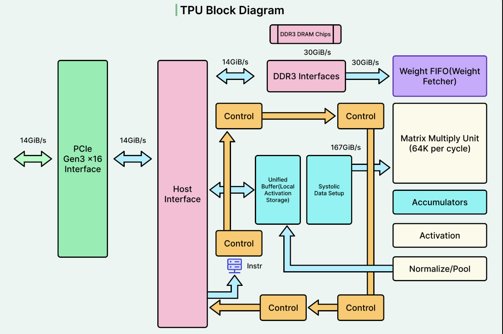

# TPU — Tensor Processing Unit

The TPU (Tensor Processing Unit) is a specialized processor designed primarily for Machine Learning workloads.

Unlike a CPU, which is designed for general-purpose computing, and a GPU, which is designed for highly parallel workloads, a TPU is specifically optimized for the mathematical operations commonly used by neural networks.



---

## What does a TPU actually do?

Neural networks perform a huge number of mathematical operations, especially matrix multiplications.

A TPU is designed to perform these operations efficiently.

A simplified flow is:

```text
ML Model
   ↓
Tensor Operations
   ↓
TPU Compiler / Runtime
   ↓
TPU Operations
   ↓
Matrix / Tensor Processing
   ↓
Result
```

For example:

```text
Matrix A × Matrix B
        ↓
   TPU computation
        ↓
     Matrix C
```

Instead of being a general-purpose processor, the TPU is designed around the types of computations that appear frequently in Machine Learning.

---

## TPU Architecture — High Level

A simplified TPU can be viewed as:

```text
                         TPU
                          │
        ┌─────────────────┼─────────────────┐
        │                 │                 │
     Matrix Unit      Vector Unit        Scalar Unit
        │                 │                 │
        └─────────────────┼─────────────────┘
                          │
                   On-chip Memory
                          │
                          ↓
                    High Bandwidth
                       Memory
                          │
                          ↓
                     Host CPU
```

Modern TPU architectures are much more complicated than this, but this model is enough to understand the main concepts.

---

## Important TPU Components

The main concepts we will cover are:

### 1. Matrix Multiply Unit

The Matrix Multiply Unit is one of the most important parts of a TPU.

It is designed to perform large matrix multiplication operations efficiently.

For example:

```text
Matrix A
   ×
Matrix B
   ↓
Matrix Multiply Unit
   ↓
Matrix C
```

Matrix multiplication is extremely common in neural networks.

It appears in operations such as:

- Fully connected layers
- Convolutions
- Attention
- Transformer layers
- Embeddings

[Learn about Matrix Multiply Units →](parts/matrix-multiply-unit.md)

---

### 2. Systolic Array

A key idea behind many TPU architectures is the systolic array.

A simplified representation is:

```text
Input
  ↓
┌───┬───┬───┬───┐
│ × │ × │ × │ × │
├───┼───┼───┼───┤
│ × │ × │ × │ × │
├───┼───┼───┼───┤
│ × │ × │ × │ × │
├───┼───┼───┼───┤
│ × │ × │ × │ × │
└───┴───┴───┴───┘
  ↓
Output
```

Data moves through the processing elements while multiplication and accumulation operations happen in parallel.

This allows the hardware to perform large matrix operations efficiently.

[Learn about Systolic Arrays →](parts/systolic-arrays.md)

---

### 3. Vector Unit

Not every operation in a neural network is a large matrix multiplication.

TPUs also contain vector processing capabilities for operations that work on vectors or other tensor data.

Examples include:

```text
Element-wise operations
Activation functions
Data transformations
Other tensor operations
```

The exact architecture depends on the TPU generation.

[Learn about Vector Processing →](parts/vector-unit.md)

---

### 4. Scalar Unit

Scalar operations work with individual values rather than large matrices or vectors.

A TPU can use scalar processing for operations such as:

```text
Control operations
Address calculations
Small computations
Other supporting operations
```

This allows the TPU to handle more than just matrix multiplication.

---

### 5. On-Chip Memory

TPUs use fast on-chip memory to keep data close to the computation units.

A simplified view is:

```text
Processing Units
      ↓
On-Chip Memory
      ↓
High Bandwidth Memory
      ↓
Host / External Memory
```

Keeping data close to the compute units can reduce expensive memory movement.

This is important because ML workloads can become limited by data movement rather than computation.

[Learn about TPU Memory →](parts/tpu-memory.md)

---

### 6. High Bandwidth Memory

TPUs use high-bandwidth memory to store data required by ML workloads.

This can include:

- Model weights
- Input tensors
- Intermediate activations
- Output tensors
- Other computation data

Large neural networks can require significant amounts of memory.

Therefore, memory capacity and bandwidth are important when selecting hardware for ML workloads.

---

# How a Neural Network Uses a TPU

Consider a simple neural network:

```text
Input
  ↓
Linear Layer
  ↓
Activation
  ↓
Linear Layer
  ↓
Output
```

A simplified execution flow is:

```text
ML Framework
      ↓
Computational Graph
      ↓
Compiler
      ↓
TPU Operations
      ↓
Matrix / Vector Processing
      ↓
Result
```

This is different from the way a CPU executes individual instructions.

The TPU is designed to efficiently execute large tensor computations generated from the ML workload.

---

# TPU Compilation

TPUs generally rely heavily on compilation.

A simplified flow is:

```text
Python / ML Framework
        ↓
Model
        ↓
Computational Graph
        ↓
Compiler
        ↓
Optimized TPU Program
        ↓
TPU
```

The compiler can analyze the computation and determine how operations should be mapped to the TPU.

This can include:

- Operation scheduling
- Memory planning
- Operation fusion
- Data movement
- Mapping computations to hardware

This makes the compiler an important part of TPU performance.

---

# XLA

XLA stands for **Accelerated Linear Algebra**.

It is a compiler used to optimize Machine Learning computations for supported hardware, including TPUs.

A simplified flow is:

```text
PyTorch / TensorFlow / JAX
             ↓
          XLA
             ↓
     Optimized computation
             ↓
            TPU
```

XLA can perform optimizations such as:

```text
Operation fusion
Constant folding
Memory optimization
Computation scheduling
Hardware-specific optimization
```

The exact compilation path depends on the framework and TPU environment.

[Learn about XLA →](parts/xla.md)

---

# TPU and Tensor Operations

TPUs are designed around tensor computation.

For example:

```text
Tensor
  ↓
Matrix Multiplication
  ↓
Activation
  ↓
Normalization
  ↓
Another Matrix Multiplication
  ↓
Output
```

Many modern ML models are dominated by these types of operations.

This is why specialized tensor hardware can provide very high performance for suitable workloads.

---

# TPU in Transformer Models

Transformers perform many matrix and tensor operations.

A simplified Transformer block contains operations such as:

```text
Input
  ↓
Embedding
  ↓
Attention
  ↓
Matrix Multiplication
  ↓
Normalization
  ↓
Feed Forward Network
  ↓
Output
```

Many of these operations can be efficiently mapped to specialized ML accelerators.

This makes TPUs particularly relevant to large-scale Deep Learning and Transformer workloads.

---

# TPU vs GPU

A simple way to think about the difference:

| GPU | TPU |
|---|---|
| Highly parallel processor | Specialized ML accelerator |
| Originally designed for graphics | Designed specifically for ML |
| General-purpose parallel compute | Specialized tensor computation |
| Uses CUDA ecosystem on NVIDIA GPUs | Strongly compiler/framework driven |
| CUDA cores + Tensor Cores | Matrix/vector/scalar processing units |
| Flexible for many workloads | Best suited to supported ML workloads |
| Widely available across cloud providers | Most commonly associated with Google Cloud |

The important point is not that one is always faster.

The correct question is:

> Which hardware is best suited to this workload, framework, model and deployment environment?

---

# TPU vs CPU

| CPU | TPU |
|---|---|
| General-purpose processor | Specialized ML accelerator |
| Designed for many types of applications | Designed primarily for ML workloads |
| Small number of powerful cores | Specialized parallel tensor hardware |
| Excellent for application logic | Excellent for tensor computation |
| Flexible | More specialized |

A typical ML system may therefore use multiple types of hardware:

```text
CPU
 │
 ├── Application logic
 ├── Networking
 ├── Data processing
 └── Coordination
          │
          ↓
     ML Accelerator
          │
       ┌──┴──┐
       │     │
      GPU   TPU
```

---

# TPU in ML Training

TPUs can be especially useful for large-scale training.

A simplified training loop is:

```text
Training Data
      ↓
TPU
      ↓
Forward Pass
      ↓
Loss
      ↓
Backward Pass
      ↓
Gradients
      ↓
Weight Update
      ↓
Next Batch
```

Large training workloads can distribute computation across multiple TPU devices.

---

# TPU Pods and Distributed Computing

Large ML workloads may require more than one TPU.

Multiple TPU devices can be connected together to form a larger compute system.

A simplified view is:

```text
                 TPU System
                     │
        ┌────────────┼────────────┐
        │            │            │
      TPU 0        TPU 1        TPU 2
        │            │            │
        └────────────┼────────────┘
                     │
                  TPU 3
```

The workload can be distributed across multiple devices.

This is important for training large models that cannot efficiently fit or execute on a single accelerator.

[Learn about TPU Pods →](parts/tpu-pods.md)

---

# TPU in ML Inference

TPUs can also be used for inference.

A simplified production pipeline is:

```text
Client Request
      ↓
API / Service
      ↓
CPU
      ↓
Preprocessing
      ↓
TPU
      ↓
Model Inference
      ↓
CPU
      ↓
Postprocessing
      ↓
Response
```

As with GPUs, the accelerator is only one part of the complete system.

For example:

```text
Preprocessing       = 20 ms
Data transfer       = 10 ms
TPU inference       = 15 ms
Postprocessing      = 15 ms

Total               = 60 ms
```

Making the TPU inference 5 ms faster does not necessarily make the complete application 5 ms faster if other parts of the pipeline dominate the latency.

---

# TPU Performance Factors

Important TPU performance factors include:

```text
TPU generation
Matrix processing capability
Memory capacity
Memory bandwidth
Model architecture
Precision
Batch size
Compiler optimization
Operation support
Data movement
Distributed configuration
```

The model must also map efficiently to the available hardware.

A theoretically powerful accelerator may perform poorly if the workload does not use its capabilities efficiently.

---

# Precision on TPUs

Machine Learning models can use different numerical formats.

Common examples include:

```text
FP32
BF16
FP16
INT8
```

Lower-precision computation can reduce memory requirements and increase computational efficiency when supported by the hardware and model.

For example:

```text
Higher precision
      ↓
More numerical precision
      ↓
Potentially higher memory usage

Lower precision
      ↓
Lower memory usage
      ↓
Potentially higher throughput
```

However, precision should be selected based on:

- Model accuracy
- Hardware support
- Compiler support
- Performance requirements
- Memory requirements

Lower precision is not automatically better.

---

# Compute-Bound vs Memory-Bound

TPU workloads can also become limited by computation or memory movement.

### Compute-Bound

The accelerator spends most of its time performing mathematical operations.

```text
Data
 ↓
TPU
 ↓
Heavy computation
 ↓
Result
```

---

### Memory-Bound

The accelerator spends significant time waiting for data.

```text
TPU
 ↓
Request data
 ↓
Memory access
 ↓
Wait
 ↓
Compute
```

In this situation, improving computation alone may not provide a large performance improvement.

Understanding this distinction is useful when optimizing ML workloads.

---

# TPU Optimization

Suppose an inference workload takes:

```text
100 ms
```

A profile might show:

```text
Data preparation      20 ms
Compilation / overhead 10 ms
TPU computation       45 ms
Memory movement       15 ms
Postprocessing        10 ms
```

Instead of simply selecting a larger TPU, we can investigate:

```text
Can operations be fused?
Can data movement be reduced?
Can the model use better precision?
Can the batch size be changed?
Can the computation graph be optimized?
Can XLA improve execution?
Is the workload actually using the TPU efficiently?
```

The goal is:

> Get the required performance from the hardware as efficiently as possible.

---

# GPU vs TPU — Practical ML Engineer View

A useful mental model is:

```text
                    ML Workload
                         │
              ┌──────────┴──────────┐
              │                     │
             GPU                   TPU
              │                     │
       Flexible accelerator    Specialized accelerator
              │                     │
       CUDA ecosystem          Compiler-driven
              │                     │
       Many workloads          Suitable ML workloads
```

GPUs are generally more flexible and widely available.

TPUs are highly specialized and can be extremely effective for workloads that map well to their architecture and software ecosystem.

---

# When Should an ML Engineer Care About TPUs?

You should understand TPUs when working with:

- Large-scale model training
- Transformer models
- JAX
- TensorFlow
- XLA
- Google Cloud ML infrastructure
- Distributed ML workloads
- Large-scale inference

You do not need to understand every hardware-level implementation detail.

The important thing is understanding:

```text
Model
  ↓
Operations
  ↓
Compiler
  ↓
Hardware Mapping
  ↓
Memory + Compute
  ↓
Performance
```

---

# CPU vs GPU vs TPU

A simple mental model:

| CPU | GPU | TPU |
|---|---|---|
| General-purpose | Highly parallel | ML-specialized |
| Sequential + parallel workloads | Massive parallel workloads | Tensor-heavy workloads |
| Application logic | ML acceleration | ML acceleration |
| Flexible | Flexible accelerator | Specialized accelerator |
| CPU instructions | GPU kernels | Compiled tensor operations |
| General computing | Graphics + ML + HPC | Primarily ML |

None of these processors is universally "best".

The right hardware depends on:

```text
Workload
Model
Framework
Latency
Throughput
Memory
Cost
Deployment environment
```

---

# What We Will Learn

```text
TPU
│
├── Matrix Multiply Units
├── Systolic Arrays
├── Vector Processing
├── Scalar Processing
├── TPU Memory
├── XLA
├── TPU Pods
├── Precision
├── Distributed Computing
├── TPU Performance
└── TPU Optimization
```

The goal is practical:

> Understand enough TPU architecture to understand how ML workloads are mapped to specialized hardware, identify performance bottlenecks, choose appropriate accelerators, and make better ML infrastructure decisions.

---

## Next

Start with:

**[Matrix Multiply Units →](parts/matrix-multiply-unit.md)**